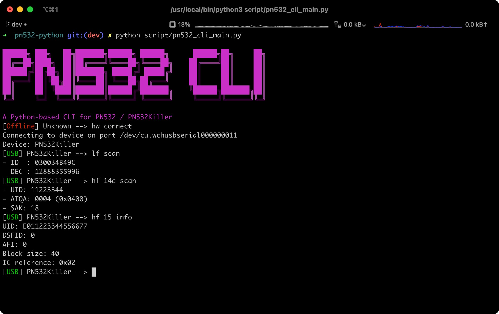

This is the Python-based CLI for PN532 and PN532Killer working on HSU (Hight Speed UART) mode. If you're using the PN532 development board, remember to switch the mode to HSU. 

 
## Hardware
- PN532 with USB Serial Chip on HSU Mode
- [All-in-one PN532](https://shop.mtoolstec.com/product/mtools-all-in-one-pn532)  
- [PN532Killer](https://pn532killer.com) 

## Requirements
Install Python 3.9+ then run the following command:
```bash
cd script
pip install -r requirements.txt
```

## Usage
Run the main script with the following command:
```bash
cd script
python pn532_cli_main.py
```

## Features
### PN532
- [x] Read and write Mifare Classic Mini, 1K, 4K
- [x] Read and write MiFare Ultralight
- [x] Magic commands for Gen1a, Gen3, Gen4 UMC
- [x] Send ISO14443A raw commands
- [x] NTAG Emulate

### PN532Killer
- [x] Tag Reader (MF1, Icode, EM4100)
- [x] Tag Emulator
- [x] MFkey32v2
- [x] MFkey64
- [x] Staticnested attack

## Protocols
### PN532
- [ISO14443A](https://www.nxp.com/docs/en/user-guide/141520.pdf)
- [ISO14443B](https://www.nxp.com/docs/en/user-guide/141520.pdf)
- [FeliCa](https://www.nxp.com/docs/en/user-guide/141520.pdf)
### PN532Killer
- [ISO14443A](https://pn532killer.com)
- [ISO14443B](https://pn532killer.com)
- [ISO15693](https://pn532killer.com)
- [EM4100](https://pn532killer.com)

## Credits
[libnfc](https://github.com/nfc-tools/libnfc)  
[Proxmark3](https://github.com/RfidResearchGroup/proxmark3)   
[Chameleon Ultra](https://github.com/RfidResearchGroup/ChameleonUltra)   

## License

The MIT License (MIT)
Copyright (c) 2016 Manuel Fernando Galindo

Permission is hereby granted, free of charge, to any person obtaining a copy of this software and associated documentation files (the "Software"), to deal in the Software without restriction, including without limitation the rights to use, copy, modify, merge, publish, distribute, sublicense, and/or sell copies of the Software, and to permit persons to whom the Software is furnished to do so, subject to the following conditions:

The above copyright notice and this permission notice shall be included in all copies or substantial portions of the Software.

THE SOFTWARE IS PROVIDED "AS IS", WITHOUT WARRANTY OF ANY KIND, EXPRESS OR IMPLIED, INCLUDING BUT NOT LIMITED TO THE WARRANTIES OF MERCHANTABILITY, FITNESS FOR A PARTICULAR PURPOSE AND NONINFRINGEMENT. IN NO EVENT SHALL THE AUTHORS OR COPYRIGHT HOLDERS BE LIABLE FOR ANY CLAIM, DAMAGES OR OTHER LIABILITY, WHETHER IN AN ACTION OF CONTRACT, TORT OR OTHERWISE, ARISING FROM, OUT OF OR IN CONNECTION WITH THE SOFTWARE OR THE USE OR OTHER DEALINGS IN THE SOFTWARE.
